# Diagrama de Arquitectura - JDV Abogados

**Fecha:** 2026-01-30

---

## 1. Jerarquía de Layouts

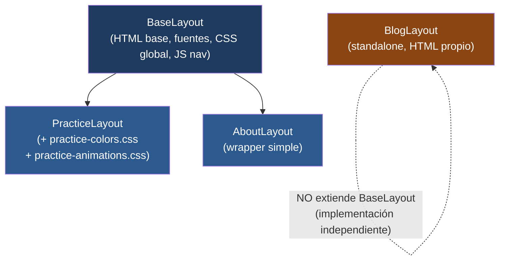

---

## 2. Mapa de Páginas y Componentes

### Home (`/`)

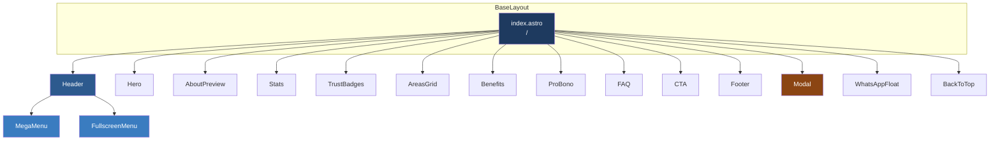

### Nosotros (`/nosotros/`)

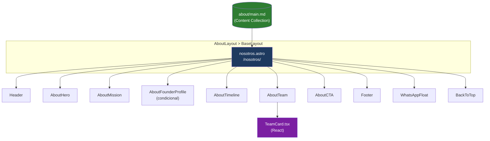

### Blog Artículo (`/blog/[slug]`)

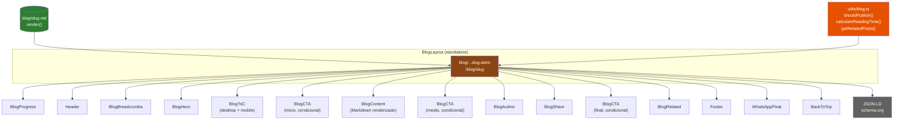

### Blog Listado (`/blog/`) y Categoría (`/blog/categoria/[cat]`)

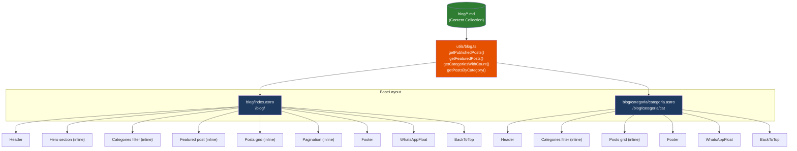

### Área de Práctica (`/areas-practicas/[slug]`)

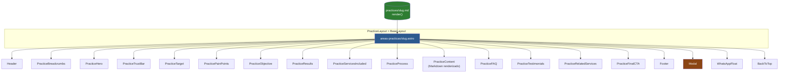

---

## 3. Componentes Compartidos entre Páginas

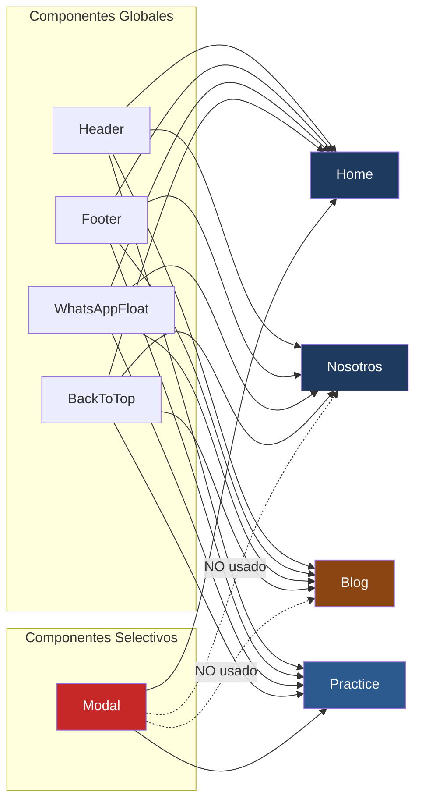

---

## 4. Flujo de Datos: Content Collections

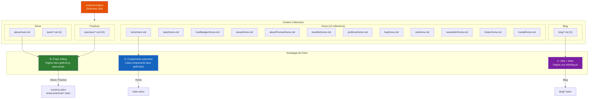

---

## 5. Navegación e Interacciones JavaScript

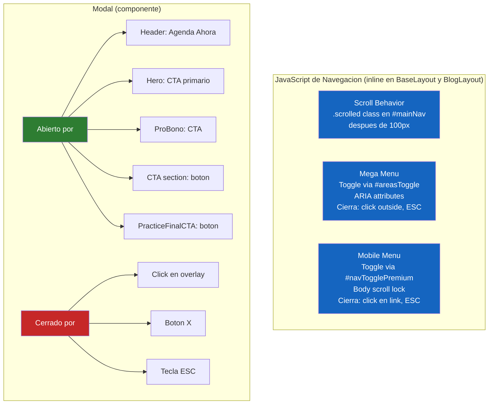

---

## 6. Estilos y CSS

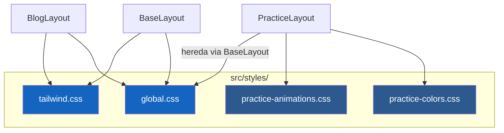

---

## 7. Tecnologías por Componente

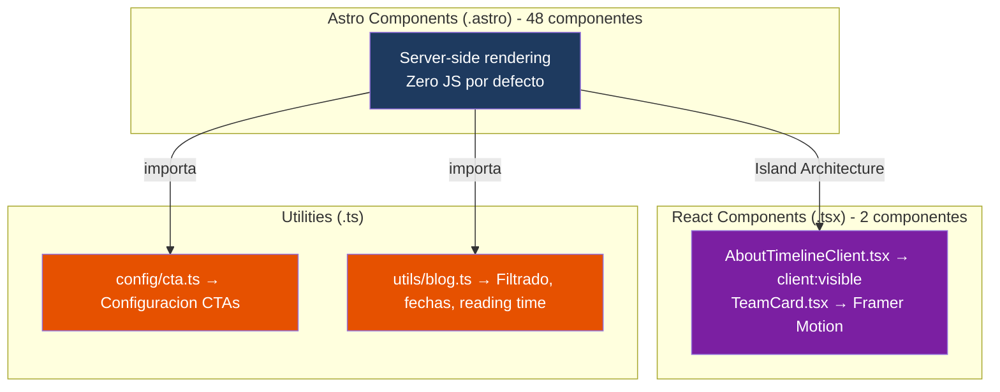
